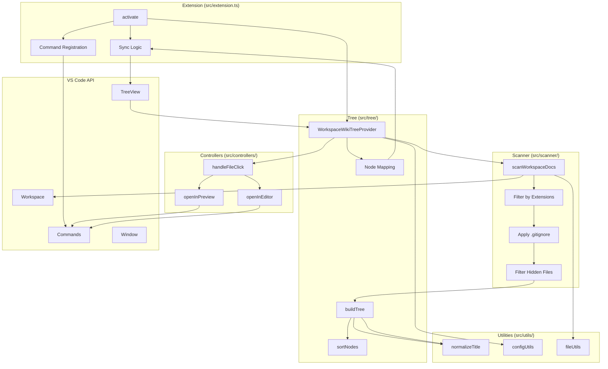
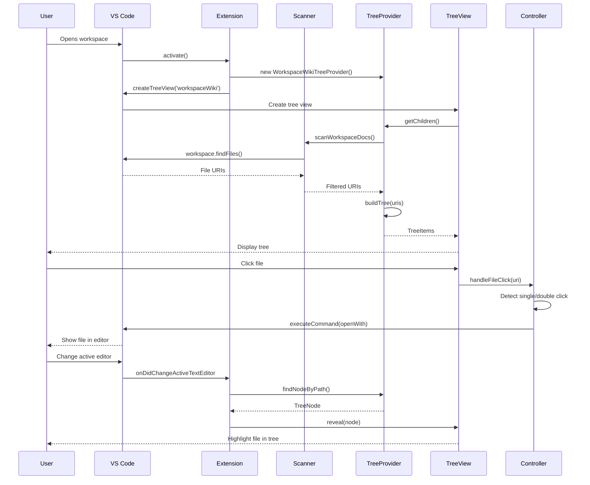

# Architecture Overview

This section explains the overall architecture of the Workspace Wiki extension, including its main modules, data flow, and integration points with VS Code.

## Main Components

- **[Scanner](../../src/scanner/workspaceScanner.ts)**: Discovers documentation files using `workspace.findFiles`, respects `.gitignore` and exclude patterns, filters hidden files, and returns URIs.
- **[Tree Provider](../../src/tree/treeProvider.ts)**: Implements VS Code's `TreeDataProvider` interface, builds hierarchical tree structure, applies ordering rules, manages node mapping for sync.
- **[Tree Builder](../../src/tree/buildTree.ts)**: Constructs hierarchical tree from flat file list, calculates common base path, sorts nodes, handles folder/file relationships.
- **[Preview Controller](../../src/controllers/previewController.ts)**: Handles file opening with double-click detection (500ms threshold), manages preview vs editor modes, respects `openWith` configuration.
- **[Configuration Utilities](../../src/utils/configUtils.ts)**: Provides typed access to extension settings with default values.
- **[Text Utilities](../../src/utils/textUtils.ts)**: Normalizes file names to human-readable titles, preserves acronym casing, handles special cases (README).
- **[File Utilities](../../src/utils/fileUtils.ts)**: Path manipulation, hidden file detection, glob pattern matching.
- **[Sync Module](../../src/extension.ts)**: Integrated into main extension activation, reveals active file in tree with configurable delay, respects visibility state.

## Source Code Structure

```text
src/
├── extension.ts              # Extension activation, command registration, sync logic
├── controllers/
│   ├── index.ts
│   └── previewController.ts  # File opening, double-click detection
├── scanner/
│   ├── index.ts
│   └── workspaceScanner.ts   # File discovery, filtering
├── tree/
│   ├── index.ts
│   ├── buildTree.ts          # Tree construction, sorting
│   └── treeProvider.ts       # VS Code TreeDataProvider implementation
├── types/
│   ├── index.ts
│   ├── treeNode.ts           # TreeNode interface
│   └── workspaceLike.ts      # Workspace abstraction for testing
└── utils/
    ├── index.ts
    ├── configUtils.ts        # Configuration access
    ├── fileUtils.ts          # Path utilities
    └── textUtils.ts          # Title normalization
```

## Subpages

- [Scanner](./scanner.md) - File discovery and filtering logic
- [Tree Data Provider](./tree-data-provider.md) - Tree view implementation
- [Preview Controller](./preview-controller.md) - File opening behavior
- [Settings](./settings.md) - Configuration options
- [Sync Module](./sync.md) - Active file revelation
- [Utilities](./utilities.md) - Helper functions

## Architecture Diagram



## Data Flow


