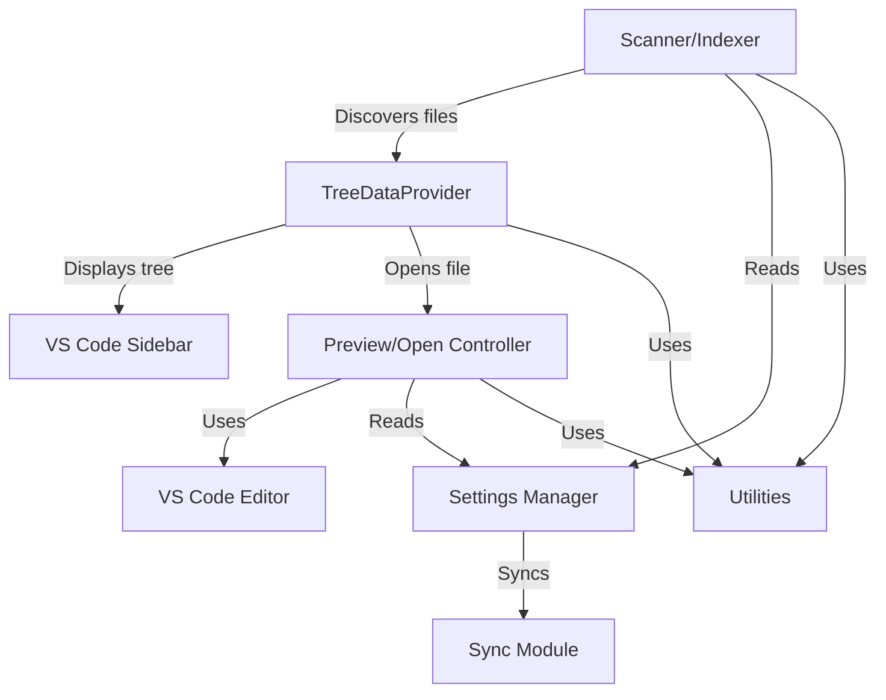

# Architecture Overview

This section explains the overall architecture of the Workspace Wiki extension, including its main modules, data flow, and integration points with VS Code.

## Main Components

- **Scanner/Indexer**: Discovers documentation files in the workspace, caches metadata, and watches for changes.
- **TreeDataProvider**: Renders the documentation tree in the sidebar, applying ordering and title normalization.
- **Preview/Open Controller**: Handles file opening (preview/editor) and user interactions.
- **Settings Manager**: Reads and applies extension settings.
- **Sync Module**: Keeps the tree in sync with the active editor.
- **Utilities**: Helpers for title normalization and file type detection.

## Subpages

- [Scanner/Indexer](./scanner.md)
- [TreeDataProvider](./tree-data-provider.md)
- [Preview/Open Controller](./preview-controller.md)
- [Settings Manager](./settings.md)
- [Sync Module](./sync.md)
- [Utilities](./utilities.md)

## Architecture Overview Diagram

This diagram shows the main modules and their interactions. The Scanner/Indexer discovers files, which are passed to the TreeDataProvider for display. The Preview/Open Controller manages file opening, and all modules use the Settings Manager and Utilities as needed. The Sync Module keeps the tree in sync with the active editor.
