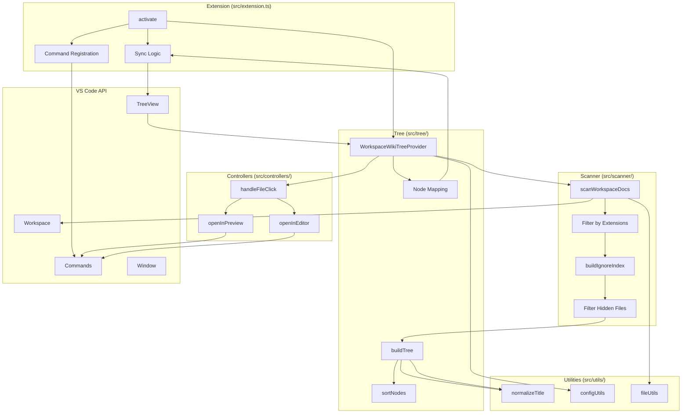
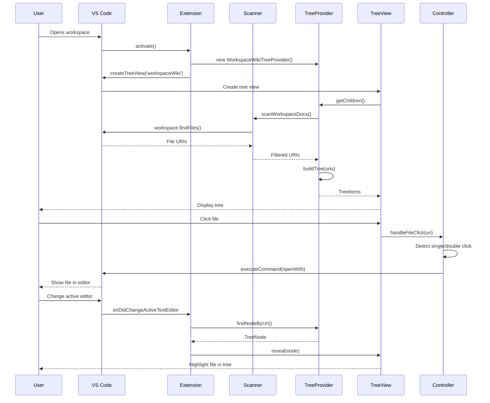

# Architecture Overview

This section explains the overall architecture of the Workspace Wiki extension, including its main modules, data flow, and integration points with VS Code.

## Runtime targets

The extension runs in two extension hosts from one set of sources. [`esbuild.js`](../../esbuild.js) emits `dist/extension.js` for the Node host used by VS Code desktop, Cursor, and Antigravity, and `dist/web/extension.js` for the Web Worker host used by vscode.dev and github.dev. [`package.json`](../../package.json) points `main` at the first and `browser` at the second.

No module branches on its environment. Node built-ins do not resolve in a Web Worker, so every file read goes through `vscode.workspace.fs` and no source file imports `fs`, `path`, or references `Buffer`. Two guards hold that line. [`tsconfig.json`](../../tsconfig.json) sets `lib` to `ES2022` and `WebWorker` rather than `DOM`, so a browser global the worker does not provide fails to compile. [`eslint.config.mjs`](../../eslint.config.mjs) restricts Node built-in imports and the `Buffer`, `process`, `__dirname`, and `__filename` globals outside test files, which is what catches the Node side, since tests legitimately use those and keep `node` in `types`.

The same rule shapes how paths are handled. `Uri.fsPath` carries no scheme information, so on a virtual file system such as `vscode-vfs://` it yields a path that no longer identifies the file. Modules therefore use `uri.toString()` for identity, `uri.path` for path structure, and `workspace.asRelativePath` for anything relative to a workspace folder.

## Main Components

- **[Scanner](../../src/scanner/workspaceScanner.ts)**: Discovers documentation files using `workspace.findFiles`, applies exclude patterns, hidden-file and depth filters, and returns URIs.
- **[Ignore Index](../../src/scanner/gitignore.ts)**: Resolves `.gitignore` rules across every workspace folder, including nested files and negation patterns, and reports whether a URI is ignored.
- **[Tree Provider](../../src/tree/treeProvider.ts)**: Implements VS Code's `TreeDataProvider` interface, builds hierarchical tree structure, applies ordering rules, manages node mapping for sync.
- **[Tree Builder](../../src/tree/buildTree.ts)**: Constructs hierarchical tree from flat file list, calculates common base path, sorts nodes, handles folder/file relationships.
- **[Preview Controller](../../src/controllers/previewController.ts)**: Handles file opening with double-click detection (500ms threshold), manages preview vs editor modes, respects `openWith` configuration.
- **[Configuration Utilities](../../src/utils/configUtils.ts)**: Provides typed access to extension settings with default values.
- **[Text Utilities](../../src/utils/textUtils.ts)**: Reads YAML front matter through `vscode.workspace.fs`, normalizes file names to human-readable titles, preserves acronym casing, handles special cases (README).
- **[File Utilities](../../src/utils/fileUtils.ts)**: Path manipulation, hidden file detection, glob pattern matching.
- **[Sync Module](../../src/extension.ts)**: Integrated into main extension activation, reveals active file in tree with configurable delay, respects visibility state.

## Source Code Structure

```text
src/
├── extension.ts              # Extension activation, command registration, sync logic
├── controllers/
│   ├── index.ts
│   └── previewController.ts  # File opening, double-click detection
├── scanner/
│   ├── index.ts
│   ├── gitignore.ts          # .gitignore discovery and matching
│   └── workspaceScanner.ts   # File discovery, filtering
├── test/
│   ├── assert.ts             # Assertions shared by the desktop and web E2E suites
│   ├── mockUri.ts            # vscode.Uri stand-in for tests
│   ├── mocks.ts              # Shared WorkspaceLike factory
│   ├── setupGlobals.ts       # TextEncoder/TextDecoder shim for jsdom
│   ├── setupTests.ts         # Virtual vscode module for Jest
│   └── web/                  # Web extension host test runner and suite
├── tree/
│   ├── index.ts
│   ├── buildTree.ts          # Tree construction, sorting
│   └── treeProvider.ts       # VS Code TreeDataProvider implementation
├── types/
│   ├── index.ts
│   ├── treeNode.ts           # TreeNode interface
│   └── workspaceLike.ts      # Injected workspace API, including file reads
└── utils/
    ├── index.ts
    ├── configUtils.ts        # Configuration access
    ├── fileUtils.ts          # Path utilities
    └── textUtils.ts          # Front matter parsing, title normalization
```

## Subpages

- [Scanner](./scanner.md) - File discovery, filtering, and `.gitignore` handling
- [Tree Data Provider](./tree-data-provider.md) - Tree view implementation
- [Preview Controller](./preview-controller.md) - File opening behavior
- [Settings](./settings.md) - Configuration options
- [Sync Module](./sync.md) - Active file revelation
- [Utilities](./utilities.md) - Helper functions

## Architecture Diagram


```mermaid
flowchart TB
    accTitle: Workspace Wiki Extension Architecture
    accDescr: Shows the relationships between the main modules - Extension activation, Scanner, Tree Provider, Controllers, Utilities, and the VS Code API they all interact with.
    subgraph Extension["Extension (src/extension.ts)"]
        A[activate]
        B[Command Registration]
        C[Sync Logic]
    end

    subgraph Scanner["Scanner (src/scanner/)"]
        D[scanWorkspaceDocs]
        E[Filter by Extensions]
        F[buildIgnoreIndex]
        G[Filter Hidden Files]
    end

    subgraph Tree["Tree (src/tree/)"]
        H[WorkspaceWikiTreeProvider]
        I[buildTree]
        J[sortNodes]
        K[Node Mapping]
    end

    subgraph Controllers["Controllers (src/controllers/)"]
        L[handleFileClick]
        M[openInPreview]
        N[openInEditor]
    end

    subgraph Utils["Utilities (src/utils/)"]
        O[normalizeTitle]
        P[configUtils]
        Q[fileUtils]
    end

    subgraph VSCode["VS Code API"]
        R[TreeView]
        S[Commands]
        T[Workspace]
        U[Window]
    end

    A --> B
    A --> C
    A --> H
    B --> S
    C --> R

    H --> D
    D --> E
    E --> F
    F --> G
    G --> I
    I --> J
    I --> O

    H --> K
    K --> C

    R --> H
    H --> L
    L --> M
    L --> N
    M --> S
    N --> S

    D --> T
    H --> P
    I --> O
    D --> Q
```

## Data Flow


```mermaid
sequenceDiagram
    accTitle: Workspace Wiki Data Flow
    accDescr: Shows the sequence from workspace open through extension activation, tree rendering, file click handling, and active-editor sync back to the user.
    participant User
    participant VSCode as VS Code
    participant Extension
    participant Scanner
    participant TreeProvider
    participant TreeView
    participant Controller

    User->>VSCode: Opens workspace
    VSCode->>Extension: activate()
    Extension->>TreeProvider: new WorkspaceWikiTreeProvider()
    Extension->>VSCode: createTreeView('workspaceWiki')
    VSCode->>TreeView: Create tree view

    TreeView->>TreeProvider: getChildren()
    TreeProvider->>Scanner: scanWorkspaceDocs()
    Scanner->>VSCode: workspace.findFiles()
    VSCode-->>Scanner: File URIs
    Scanner-->>TreeProvider: Filtered URIs
    TreeProvider->>TreeProvider: buildTree(uris)
    TreeProvider-->>TreeView: TreeItems
    TreeView-->>User: Display tree

    User->>TreeView: Click file
    TreeView->>Controller: handleFileClick(uri)
    Controller->>Controller: Detect single/double click
    Controller->>VSCode: executeCommand(openWith)
    VSCode-->>User: Show file in editor

    User->>VSCode: Change active editor
    VSCode->>Extension: onDidChangeActiveTextEditor
    Extension->>TreeProvider: findNodeByUri()
    TreeProvider-->>Extension: TreeNode
    Extension->>TreeView: reveal(node)
    TreeView-->>User: Highlight file in tree
```
