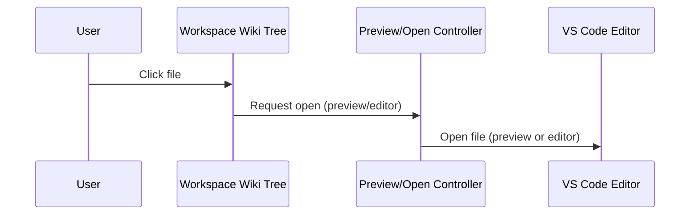

# Preview/Open Controller

This module manages how files are opened from the Workspace Wiki tree.

## Features

- Single-click: Opens file in preview mode.
- Double-click: Opens file in full editor mode.
- Context menu: Additional actions (e.g., open to the side).
- Uses VS Code commands like `vscode.openWith` and `window.showTextDocument`.

## Example

```ts
vscode.commands.executeCommand('vscode.openWith', uri, 'vscode.markdown.preview');
```

## Customization

- Default open mode can be set in settings (`preview` or `editor`).
- File type handlers can be customized (e.g., open `.pdf` with a specific extension).

See also: [Settings Manager](./settings.md)

## File Open Flow



This diagram shows how user actions in the tree trigger file opening in preview or editor mode.
