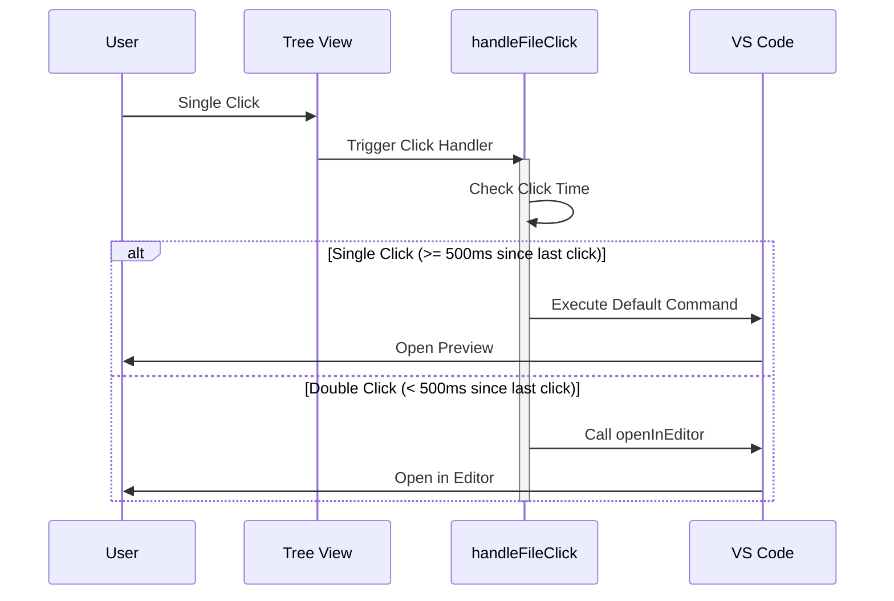

# Preview/Open Controller

This module manages how files are opened from the Workspace Wiki tree.

## Implementation

The Preview/Open Controller is implemented in [`src/controllers/previewController.ts`](../../src/controllers/previewController.ts) with the following key functions:

- `handleFileClick()` - Handles file clicks with double-click detection
- `openInPreview()` - Opens files in preview mode
- `openInEditor()` - Opens files in editor mode, pinning the plain text editor for files the Markdown Editor would claim
- `openMarkdown()` - Opens a Markdown file in the best surface the running VS Code offers

## Features

- Single-click: Runs the tree item's default command. In the default `workspaceWiki.defaultOpenMode: preview`, that command comes from `workspaceWiki.openWith` (for `.md`, `.markdown`, and `.mdx`, the shipped default is `workspace-wiki.openMarkdown`, described in [Markdown Open Chain](#markdown-open-chain) below). In `editor` mode, it is `vscode.open`.
- Double-click: Opens file in full editor mode. Markdown files the Markdown Editor claims are pinned to the plain text editor; every other file goes through `vscode.open`.
- Context menu: Open in Preview and Edit, mirroring single-click and double-click.

## Double-Click Detection

The controller includes sophisticated double-click detection with a 500ms threshold:

```typescript
// Track last click times for double-click detection
const lastClickTimes: Map<string, number> = new Map();
const DOUBLE_CLICK_THRESHOLD = 500; // milliseconds
```

## Example

```ts
// Single click: opens via the configured openWith command
// (default workspace-wiki.openMarkdown for Markdown, vscode.open otherwise)
openInPreview(uri);

// Double click: opens in editor, pinning the text editor for Markdown
openInEditor(uri);
```

## Markdown Open Chain

`workspace-wiki.openMarkdown` is a command this extension registers, not a VS Code one. Which
Markdown surface exists depends on the running version, so the choice is made at click time rather
than baked into a setting:

1. **Markdown Editor** (`vscode.openWith` with viewType `vscode.markdown.editor`) when some
   extension contributes that custom editor and one of its selector patterns matches the file name.
   VS Code contributes it from 1.131 onward, with a `*.md` selector.
2. **Markdown Preview** (`markdown.showPreview`) when the Markdown Editor does not claim the file, or
   is not present at all. This covers `.mdx`, `.markdown`, an extensionless `README`, and every
   VS Code before 1.131.
3. **A plain open** (`vscode.open`), which resolves whatever the user set in
   `workbench.editorAssociations`, when neither of the above is available.

The claim in step 1 is read from the live `customEditors` contribution rather than tested against a
hardcoded `.md`, so a VS Code that changes the selector is followed without a code change.

`vscode.openWith` given a viewType no registered editor matches resolves to nothing and reports no
error, so the click would do nothing at all. That is why availability is checked before the call
rather than by catching a failure.

## Customization

- Default open mode can be set in settings (`preview` or `editor`).
- File type handlers can be customized (e.g., open `.pdf` with a specific extension).

See also: [Settings Manager](./settings.md)

## File Open Flow


```mermaid
sequenceDiagram
	accTitle: File Open Double-Click Detection Flow
	accDescr: Shows how a user click on a tree item is handled - single clicks (gap >= 500ms since last click) open the file in preview mode, while double clicks (gap < 500ms) open the file in the editor.
	participant User as User
	participant Tree as Tree View
	participant Handler as handleFileClick
	participant Command as VS Code
	User->>Tree: Single Click
	Tree->>Handler: Trigger Click Handler
	activate Handler
	Handler->>Handler: Check Click Time
	alt Single Click (>= 500ms since last click)
		Handler->>Command: Execute Default Command
		Command->>User: Open Preview
	else Double Click (< 500ms since last click)
		Handler->>Command: Call openInEditor
		Command->>User: Open in Editor
	end
	deactivate Handler
```

This diagram shows the double-click detection flow: single clicks run the default command configured by the tree item, while double clicks within 500ms open files in the full editor.
