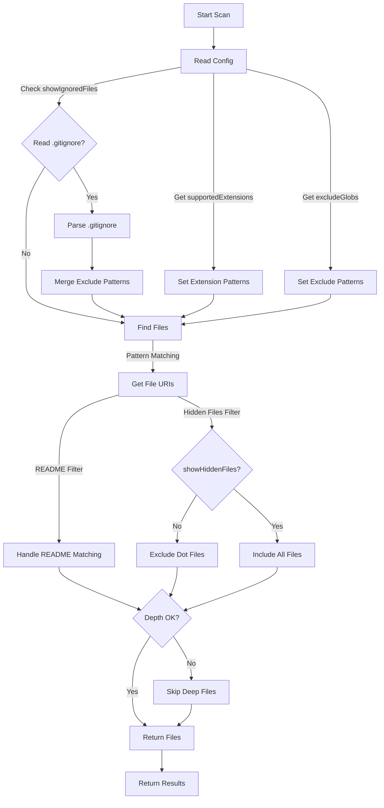

# Scanner

The scanner discovers documentation files in the workspace and returns matching URIs. It does not cache metadata or watch for changes.

## Implementation

The Scanner/Indexer is implemented in [`src/scanner/workspaceScanner.ts`](../../src/scanner/workspaceScanner.ts) with the main function `scanWorkspaceDocs()`.

## How It Works

- Uses `workspace.findFiles` to locate files matching supported extensions (e.g., `.md`, `.markdown`, `.txt`).
- If Markdown is a supported extension, also scans for files named `README` (with no extension, case-insensitive) and treats them as Markdown.
- Applies exclude patterns from settings and `.gitignore`.
- Filters hidden files/folders (starting with dot) based on `showHiddenFiles` setting.
- Filters ignored files based on `showIgnoredFiles` setting and exclude patterns.
- Returns matching URIs to the tree provider, which rebuilds the tree on refresh.

## File Filtering Logic

1. **Extension Matching**: Only includes files with supported extensions
2. **README (no extension) Matching**: If Markdown is supported, also includes files named `README` (no extension, case-insensitive) as Markdown
3. **Exclude Pattern Filtering**: Applies `excludeGlobs` and `.gitignore` patterns
4. **Hidden File Filtering**: Excludes files/folders starting with `.` unless `showHiddenFiles` is true
5. **Ignored File Filtering**: Excludes files in `.gitignore` unless `showIgnoredFiles` is true
6. **Depth Limiting**: Respects `maxSearchDepth` setting by calculating depth relative to workspace root

## Depth Calculation

The scanner calculates file depth relative to the workspace root for the `maxSearchDepth` feature:

- Uses `vscode.workspace.workspaceFolders[0]` to determine workspace root
- Normalizes all paths to use forward slashes for cross-platform compatibility
- Calculates relative path by removing workspace root prefix
- Counts directory separators to determine depth level
- Falls back gracefully when workspace root cannot be determined (skips depth filtering)

## Example

```ts
// Standard scan for supported extensions
const files = await vscode.workspace.findFiles('**/*.{md,markdown,txt}', '**/node_modules/**');
// Additionally, if Markdown is supported, scan for README (no extension)
const readmes = await vscode.workspace.findFiles('**/README', '**/node_modules/**');
```

## Edge Cases

- Large repos: Respects `maxSearchDepth` setting.
- Symlinks: Not followed by default.
- Binary files: Skipped.

See also: [Settings Manager](./settings.md)

## Scanner/Indexer Flow



This diagram shows the core scanning process: reading configuration, matching file patterns, filtering by various rules, and returning results.
