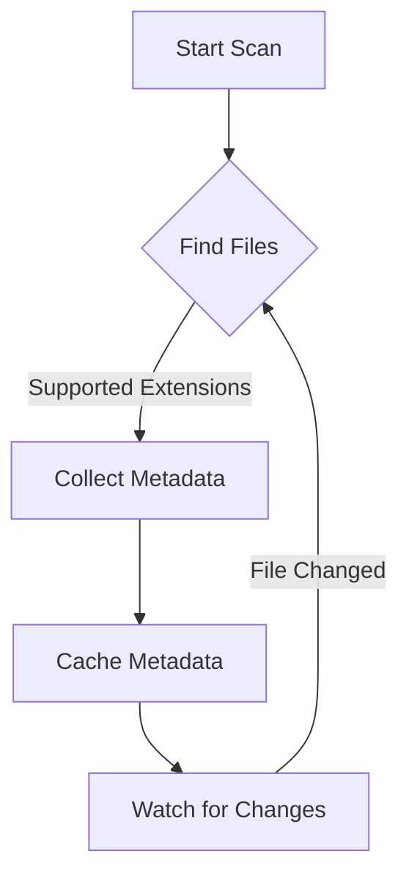

# Scanner and Indexer

The Scanner/Indexer is responsible for discovering documentation files in the workspace, caching their metadata, and watching for changes.

## Implementation

The Scanner/Indexer is implemented in [`src/extension.ts`](../../src/extension.ts) with the main function `scanWorkspaceDocs()`.

## How It Works

- Uses `workspace.findFiles` to locate files matching supported extensions (e.g., `.md`, `.markdown`, `.txt`).
- Applies exclude patterns from settings and `.gitignore`.
- Filters hidden files/folders (starting with dot) based on `showHiddenFiles` setting.
- Filters ignored files based on `showIgnoredFiles` setting and exclude patterns.
- Caches metadata: file path, title (normalized), and modification time.
- Sets up a file system watcher to auto-refresh the tree on changes.

## File Filtering Logic

1. **Extension Matching**: Only includes files with supported extensions
2. **Exclude Pattern Filtering**: Applies `excludeGlobs` and `.gitignore` patterns
3. **Hidden File Filtering**: Excludes files/folders starting with `.` unless `showHiddenFiles` is true
4. **Ignored File Filtering**: Excludes files in `.gitignore` unless `showIgnoredFiles` is true
5. **Depth Limiting**: Respects `maxSearchDepth` setting

## Example

```ts
const files = await vscode.workspace.findFiles('**/*.{md,markdown,txt}', '**/node_modules/**');
```

## Edge Cases

- Large repos: Respects `maxSearchDepth` setting.
- Symlinks: Not followed by default.
- Binary files: Skipped.

See also: [Settings Manager](./settings.md)

## Scanner/Indexer Flow



This diagram shows the scanning process: finding files, collecting and caching metadata, and watching for changes.
