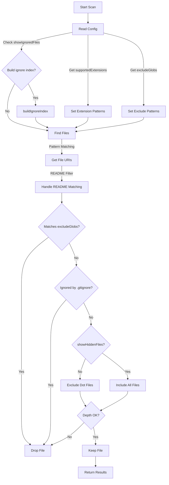

# Scanner

The scanner discovers documentation files in the workspace and returns matching URIs. It does not cache metadata or watch for changes.

## Implementation

The Scanner/Indexer is implemented in [`src/scanner/workspaceScanner.ts`](../../src/scanner/workspaceScanner.ts) with the main function `scanWorkspaceDocs()`.

## How It Works

- Uses `workspace.findFiles` to locate files matching supported extensions (for example `.md`, `.markdown`, `.txt`).
- If Markdown is a supported extension, also scans for files named `README` (with no extension, case-insensitive) and treats them as Markdown.
- Unless `showIgnoredFiles` is enabled, passes `excludeGlobs` to `findFiles` as its exclude argument and re-checks each result with `matchesGlobPattern` from [`fileUtils.ts`](../../src/utils/fileUtils.ts), then consults the ignore index for `.gitignore` rules.
- Filters hidden files and folders (those starting with a dot) based on the `showHiddenFiles` setting.
- Returns matching URIs to the tree provider, which rebuilds the tree on refresh.

File reads and searches arrive through the `WorkspaceLike` seam in [`workspaceLike.ts`](../../src/types/workspaceLike.ts). URI and glob construction uses the `vscode` namespace directly, since `vscode.Uri` and `vscode.RelativePattern` are values rather than injectable behaviour. Neither route reaches a Node built-in, so the scanner behaves identically in the Web Worker extension host.

## File Filtering Logic

1. **Extension Matching**: Only includes files with supported extensions
2. **README (no extension) Matching**: If Markdown is supported, also includes files named `README` (no extension, case-insensitive) as Markdown
3. **Exclude Pattern Filtering**: Applies `excludeGlobs` as both a search exclusion and a post-filter, unless `showIgnoredFiles` is true
4. **Ignored File Filtering**: Excludes files the ignore index reports as ignored, unless `showIgnoredFiles` is true
5. **Hidden File Filtering**: Excludes files and folders starting with `.` unless `showHiddenFiles` is true
6. **Depth Limiting**: Respects `maxSearchDepth` setting

## Gitignore handling

`.gitignore` rules are resolved by [`buildIgnoreIndex`](../../src/scanner/gitignore.ts) rather than folded into the exclude glob. The exclude argument of `findFiles` accepts a single glob pattern, which cannot express a negation such as `!keep.md`, and a flat glob list also loses the directory scoping and ordering that git's semantics depend on. The index therefore evaluates each candidate URI directly, using the [ignore](https://github.com/kaelzhang/node-ignore) package for pattern matching.

The index reproduces git's behaviour in four respects:

- **Negation**: a later `!pattern` re-includes a file an earlier rule excluded.
- **Parent exclusion**: a file beneath an ignored directory stays ignored, because git never descends into one. `isIgnored` walks each ancestor directory before the file itself and stops at the first ignored ancestor.
- **Nesting**: a `.gitignore` in a subdirectory governs only paths beneath it, and overrides shallower files for those paths.
- **Per-folder scope**: rules are collected and applied per workspace folder, so one root of a multi-root workspace never filters another. A URI is attributed to the workspace folder whose URI is its longest matching prefix, which resolves correctly when one folder is nested inside another.

Discovery searches each folder with a `RelativePattern` and additionally reads `<folder>/.gitignore` directly. The direct read means a host whose `findFiles` does not surface dotfiles degrades to root-level rules rather than silently applying none. A `.gitignore` inside a directory matched by `excludeGlobs` is not discovered, matching git, which would not descend there either.

## Depth Calculation

The scanner calculates file depth for the `maxSearchDepth` feature with `workspace.asRelativePath(uri, false)`, then counts the separators in the result. Depth is measured from the workspace folder that contains the file, so each root of a multi-root workspace is judged on its own terms.

## Example

```ts
// One search per configured extension, not a single combined pattern
for (const ext of supportedExtensions) {
	await workspace.findFiles(`**/*.${ext}`, '{**/node_modules/**,**/.git/**}');
}
// Additionally, if Markdown is supported, scan for README (no extension)
const readmes = await workspace.findFiles('**/README', '{**/node_modules/**,**/.git/**}');
```

## Testing

[`workspaceScanner.test.ts`](../../src/scanner/workspaceScanner.test.ts) covers filtering, settings fallbacks, and depth limiting; [`gitignore.test.ts`](../../src/scanner/gitignore.test.ts) covers negation, parent exclusion, anchoring, nested overrides, multi-root isolation, and virtual file system schemes. Both build their workspace through `createMockWorkspace` in [`mocks.ts`](../../src/test/mocks.ts), which supplies the whole `WorkspaceLike` seam and returns undefined for unset settings so that production fallbacks are the ones under test.

## Edge Cases

- Large repos: Respects `maxSearchDepth` setting.
- Symlinks: Not followed by default.
- Binary files: Skipped.

See also: [Settings Manager](./settings.md)

## Scanner/Indexer Flow


```mermaid
flowchart TD
	accTitle: Scanner File Discovery Flow
	accDescr: Shows the scanning process. The scanner reads configuration, builds an ignore index from the workspace .gitignore files unless showIgnoredFiles is enabled, runs findFiles for each supported extension, then filters the results by exclude glob, ignore index, hidden-file rule, and depth before returning them.
	A[Start Scan] --> B[Read Config]
	B -->|Get supportedExtensions| C[Set Extension Patterns]
	B -->|Get excludeGlobs| D[Set Exclude Patterns]
	B -->|Check showIgnoredFiles| E{Build ignore index?}
	E -->|Yes| F[buildIgnoreIndex]
	E -->|No| G[Find Files]
	F --> G
	C --> G
	D --> G
	G -->|Pattern Matching| I[Get File URIs]
	I -->|README Filter| J[Handle README Matching]
	J --> R{Matches excludeGlobs?}
	R -->|Yes| P[Drop File]
	R -->|No| S{Ignored by .gitignore?}
	S -->|Yes| P
	S -->|No| K{showHiddenFiles?}
	K -->|No| L[Exclude Dot Files]
	K -->|Yes| M[Include All Files]
	L --> N{Depth OK?}
	M --> N
	N -->|No| P
	N -->|Yes| O[Keep File]
	O --> Q[Return Results]
```

This diagram shows the core scanning process: reading configuration, matching file patterns, filtering by exclude globs, `.gitignore` rules, the hidden-file rule, and depth, then returning results.
