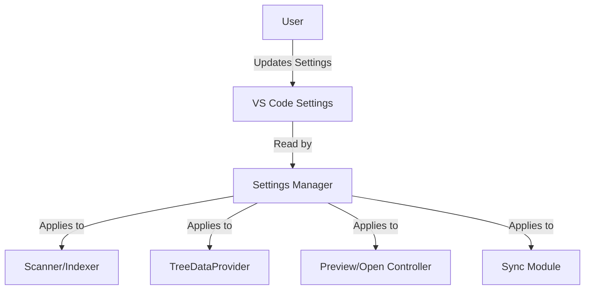

# Settings Manager

The Settings Manager reads and applies user configuration for the Workspace Wiki extension.

## Supported Settings

### File Discovery & Filtering

- `workspaceWiki.supportedExtensions`: File types to scan (default: `md`, `markdown`, `txt`).
- `workspaceWiki.excludeGlobs`: Patterns to exclude (e.g., `**/node_modules/**`).
- `workspaceWiki.maxSearchDepth`: Limit scan depth for large repos.
- `workspaceWiki.showIgnoredFiles`: Show files listed in .gitignore and excludeGlobs (default: false).
- `workspaceWiki.showHiddenFiles`: Show hidden files/folders starting with a dot (default: false).

### File Opening & Display

- `workspaceWiki.defaultOpenMode`: `preview` or `editor`.
- `workspaceWiki.openWith`: Commands to use for opening different file types.
- `workspaceWiki.directorySort`: How to sort files and folders (default: "files-first").

### Title Formatting

- `workspaceWiki.acronymCasing`: Acronyms to preserve proper casing in file titles.

### Sync & Auto-Reveal

- `workspaceWiki.autoReveal`: Enable automatic file revelation in tree (default: `true`).
- `workspaceWiki.autoRevealDelay`: Delay in milliseconds before revealing (default: `500`).

## Example

```ts
const config = vscode.workspace.getConfiguration('workspaceWiki');
const extensions = config.get<string[]>('supportedExtensions');
```

## How to Change Settings

- Open Command Palette → Preferences: Open Settings (UI)
- Search for "Workspace Wiki"

See also: [Usage/Setup](../usage/setup.md)

## Settings Flow



This diagram shows how user settings are read and applied by the Settings Manager to all major modules.
