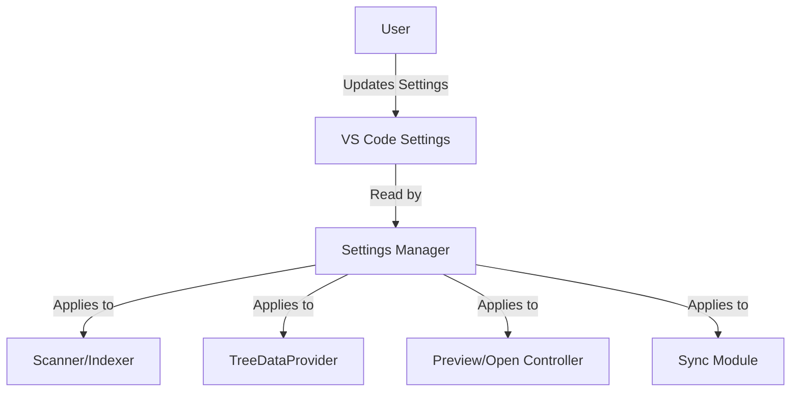

# Settings Manager

The Settings Manager reads and applies user configuration for the Workspace Wiki extension.

## Supported Settings

### File Discovery & Filtering

- `workspaceWiki.supportedExtensions`: File types to scan (default: `md`, `markdown`, `txt`).
    - If `md` or `markdown` is included, files named `README` (no extension, case-insensitive) are also included and treated as Markdown.
- `workspaceWiki.excludeGlobs`: Glob patterns to exclude files and folders (default: `**/node_modules/**`, `**/.git/**`).
- `workspaceWiki.maxSearchDepth`: Maximum directory depth to search for documentation files (default: `10`).
- `workspaceWiki.showIgnoredFiles`: Show files listed in `.gitignore` and matched by `excludeGlobs` patterns (default: `false`).
- `workspaceWiki.showHiddenFiles`: Show hidden files and folders starting with a dot (e.g., `.github`, `.env`) (default: `false`).

### File Opening & Display

- `workspaceWiki.defaultOpenMode`: `preview` or `editor` (default: `preview`).
- `workspaceWiki.openWith`: Commands to use for opening different file types (default: `markdown.showPreview` for `.md`/`.markdown`, `vscode.open` for `.txt`).
- `workspaceWiki.directorySort`: How to sort files and folders: `files-first`, `folders-first`, or `alphabetical` (default: `files-first`).

### Title Formatting

- `workspaceWiki.acronymCasing`: Acronyms to preserve proper casing in file titles (default: `HTML`, `CSS`, `JS`, `TS`, `API`, `URL`, `JSON`, `XML`, `HTTP`, `HTTPS`, `REST`, `SQL`, `CSV`, `FHIR`).

### Sync & Auto-Reveal

- `workspaceWiki.autoReveal`: Automatically reveal the active file in the Workspace Wiki tree when the editor changes (default: `true`).
- `workspaceWiki.autoRevealDelay`: Delay in milliseconds before revealing the active file (default: `500`). Set to `0` for immediate reveal.

## Example

```ts
const config = vscode.workspace.getConfiguration('workspaceWiki');
const extensions = config.get<string[]>('supportedExtensions');
```

## How to Change Settings

- Open Command Palette → Preferences: Open Settings (UI)
- Search for "Workspace Wiki"

See also: [Usage/Setup](../usage/setup.md)

## Settings Flow



This diagram shows how user settings are read and applied by the Settings Manager to all major modules.
