# Settings Manager

The Settings Manager reads and applies user configuration for the Workspace Wiki extension.

## Supported Settings

- `workspaceWiki.supportedExtensions`: File types to scan (default: `md`, `markdown`, `txt`).
- `workspaceWiki.excludeGlobs`: Patterns to exclude (e.g., `**/node_modules/**`).
- `workspaceWiki.defaultOpenMode`: `preview` or `editor`.
- `workspaceWiki.syncWithActiveEditor`: Auto-reveal active file in tree.
- `workspaceWiki.maxSearchDepth`: Limit scan depth for large repos.

## Example

```ts
const config = vscode.workspace.getConfiguration('workspaceWiki');
const extensions = config.get<string[]>('supportedExtensions');
```

## How to Change Settings

- Open Command Palette → Preferences: Open Settings (UI)
- Search for "Workspace Wiki"

See also: [Usage/Setup](../usage/setup.md)

## Settings Flow

```mermaid
flowchart TD
	A[User] -->|Updates Settings| B[VS Code Settings]
	B -->|Read by| C[Settings Manager]
	C -->|Applies to| D[Scanner/Indexer]
	C -->|Applies to| E[TreeDataProvider]
	C -->|Applies to| F[Preview/Open Controller]
	C -->|Applies to| G[Sync Module]
```



This diagram shows how user settings are read and applied by the Settings Manager to all major modules.
