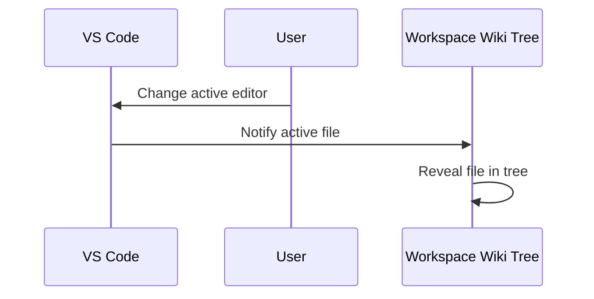

# Sync Module

The Sync Module keeps the Workspace Wiki tree in sync with the active editor in VS Code.

## Features

- Listens to `window.onDidChangeActiveTextEditor` events.
- Reveals the corresponding file in the tree when you switch editors.
- Can be toggled via the `workspaceWiki.syncWithActiveEditor` setting.
- Optional auto-reveal delay for smoother UX.

## Example

```ts
vscode.window.onDidChangeActiveTextEditor((editor) => {
	// Reveal file in tree
});
```

## Edge Cases

- Only reveals files that are part of the documentation tree.
- Respects excludes and supported extensions.

See also: [Settings Manager](./settings.md)

## Sync Module Sequence



This diagram shows how the sync module listens for editor changes and reveals the corresponding file in the tree.
