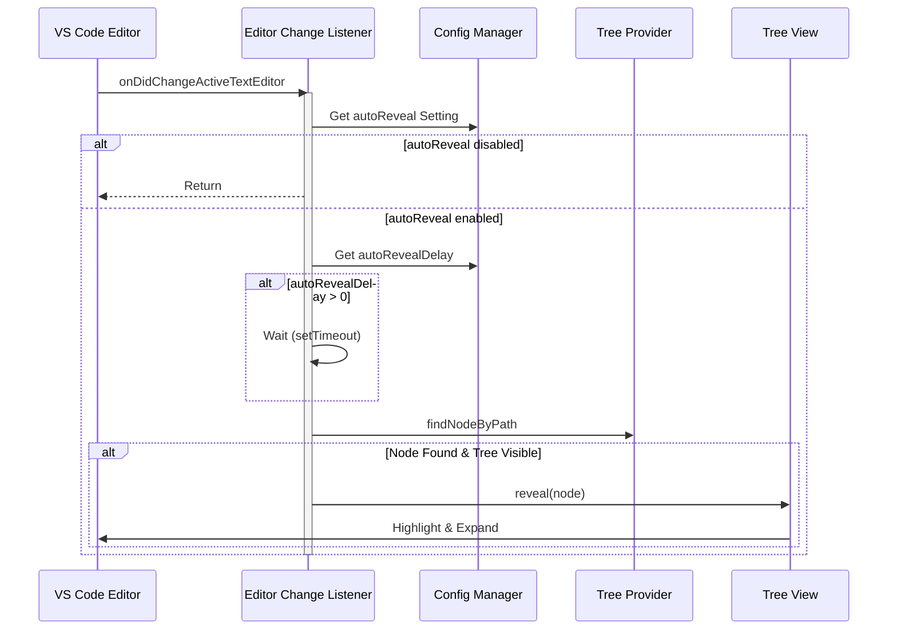

# Sync Module

The Sync Module keeps the Workspace Wiki tree in sync with the active editor in VS Code. When you switch between files, the corresponding file is automatically highlighted and revealed in the tree view.

## Features

- **Auto-reveal**: Automatically reveals the active file in the tree when you switch editors
- **Configurable delay**: Set a delay before revealing to prevent excessive tree updates
- **Smart filtering**: Only reveals files that are supported by the Workspace Wiki extension
- **Tree expansion**: Automatically expands parent folders to show the active file
- **VS Code web compatible**: Works in both desktop and web versions of VS Code

## Configuration

### `workspaceWiki.autoReveal`

- **Type**: `boolean`
- **Default**: `true`
- **Description**: Enable or disable automatic file revelation in the tree

### `workspaceWiki.autoRevealDelay`

- **Type**: `number` (milliseconds)
- **Default**: `500`
- **Description**: Delay before revealing the active file. Set to 0 for real-time reveal.

## Implementation

```ts
// Listen for active editor changes
const editorChangeListener = vscode.window.onDidChangeActiveTextEditor(() => {
	revealActiveFile();
});

const revealActiveFile = () => {
	const config = vscode.workspace.getConfiguration('workspaceWiki');
	const autoReveal = config.get('autoReveal', true);
	const autoRevealDelay = config.get('autoRevealDelay', 500);

	if (!autoReveal) return;

	const activeEditor = vscode.window.activeTextEditor;
	if (!activeEditor) return;

	// Check if file is supported
	const activeFilePath = activeEditor.document.uri.fsPath;
	const supportedExtensions = config.get('supportedExtensions', ['md', 'markdown', 'txt']);
	const fileExt = activeFilePath.split('.').pop()?.toLowerCase();

	if (!fileExt || !supportedExtensions.includes(fileExt)) return;

	// Reveal with delay
	if (autoRevealDelay > 0) {
		setTimeout(() => doReveal(), autoRevealDelay);
	} else {
		doReveal();
	}
};
```

## Requirements

The sync functionality requires the `TreeDataProvider` to implement:

- `getParent()` method for tree navigation
- `findNodeByPath()` method for efficient lookups
- Node mapping for O(1) path resolution

## Edge Cases

- Only reveals files that match `supportedExtensions`
- Respects `excludeGlobs` and `.gitignore` patterns
- Tree view must be visible for revelation to work
- Handles path normalization for cross-platform compatibility

See also: [Tree Data Provider](./tree-data-provider.md), [Settings](./settings.md)

## Sync Module Sequence



This diagram shows how the sync module listens for active editor changes, checks configuration, and reveals the corresponding file in the tree with optional delay.
