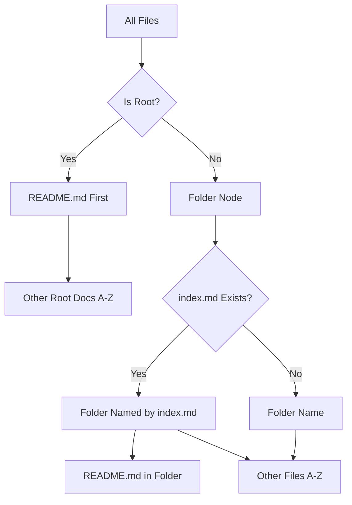

# TreeDataProvider

The TreeDataProvider module powers the Workspace Wiki sidebar tree, converting file system entries into readable, ordered nodes.

## Implementation

The TreeDataProvider is implemented in [`src/extension.ts`](../../src/extension.ts) as the `WorkspaceWikiTreeProvider` class, along with the `buildTree()` helper function.

## Responsibilities

- Implements VS Code's `TreeDataProvider` interface.
- Applies ordering rules:
    - `README.md` at root always first
    - Root-level docs next (alphabetical)
    - Folders (with `index.md` as folder node)
    - Files inside folders (alphabetical, with `README.md` at top)
- Normalizes file names to human-friendly titles.

## Key Methods

- `getTreeItem()` - Converts tree nodes to VS Code TreeItem objects
- `getChildren()` - Returns child nodes for tree expansion
- `createTreeItem()` - Creates tree items with proper commands and icons

## Example

```ts
class WikiTreeDataProvider implements vscode.TreeDataProvider<WikiNode> {
	// ...
}
```

## Example Tree

```text
Workspace Wiki
├── README
├── Changelog
├── Docs
│   ├── README
│   └── API
```

See also: [Scanner/Indexer](./scanner.md)

## TreeDataProvider Ordering Logic



This diagram shows how files are ordered and displayed in the tree.
