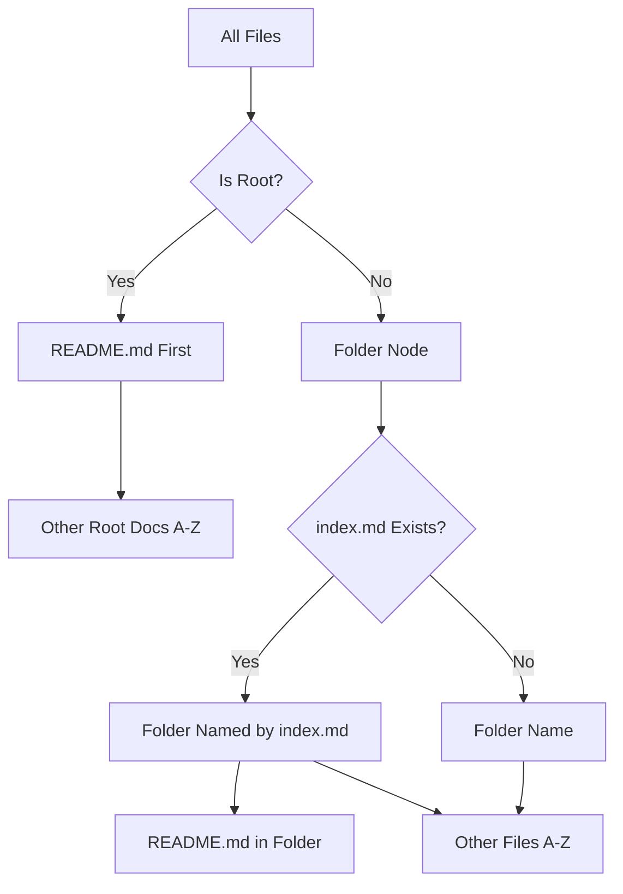

# TreeDataProvider

The TreeDataProvider module powers the Workspace Wiki sidebar tree, converting file system entries into readable, ordered nodes.

## Implementation

The TreeDataProvider is implemented in [`src/tree/treeProvider.ts`](../../src/tree/treeProvider.ts) as the `WorkspaceWikiTreeProvider` class, along with the `buildTree()` helper function in [`src/tree/buildTree.ts`](../../src/tree/buildTree.ts). The TreeNode interface is defined in [`src/types/treeNode.ts`](../../src/types/treeNode.ts).

## Architecture Changes

**Recent Improvements:**

- **Modular Structure**: TreeDataProvider moved from `src/extension.ts` to dedicated `src/tree/` module
- **Type Organization**: `TreeNode` interface moved to `src/types/` for better type organization
- **Path Imports**: Updated to support `@tree` imports via index.ts for cleaner imports
- **Comprehensive Testing**: Added full unit test coverage for all tree functionality

## Responsibilities

- Implements VS Code's `TreeDataProvider` interface.
- Applies ordering rules:
    - `README.md` at root always first
    - Root-level docs next (alphabetical)
    - Folders (with `index.md` as folder node)
    - Files inside folders (alphabetical, with `README.md` at top)
- Normalizes file names to human-friendly titles.
- Supports sync functionality with active editor
- Provides efficient file path lookups via node mapping
- Handles tree view enhancements (collapse all, inline actions)

## Key Methods

- `getTreeItem()` - Converts tree nodes to VS Code TreeItem objects
- `getChildren()` - Returns child nodes for tree expansion
- `getParent()` - Returns parent node for sync and reveal functionality
- `createTreeItem()` - Creates tree items with proper commands and icons
- `findNodeByPath()` - Efficient file path lookups for sync module
- `refresh()` - Triggers tree data change event; node map is cleared and rebuilt lazily on next `getChildren()` call

## Testing

**Unit Tests:**

- [`src/tree/buildTree.test.ts`](../../src/tree/buildTree.test.ts) - Tests for title normalization and tree building logic
- [`src/tree/treeProvider.test.ts`](../../src/tree/treeProvider.test.ts) - Tests for WorkspaceWikiTreeProvider class methods

**Test Coverage:**

- Tree building with various folder structures
- Title normalization including acronym handling
- File and folder sorting behaviors
- Node mapping and path lookups
- Tree refresh and state management
- Edge cases and error handling

## Example

```ts
// Import the tree provider
import { WorkspaceWikiTreeProvider } from '@tree';

// Initialize the provider
const treeProvider = new WorkspaceWikiTreeProvider(
	vscode.workspace,
	vscode.TreeItem,
	vscode.TreeItemCollapsibleState,
	vscode.EventEmitter,
);
```

## Example Tree

```text
Workspace Wiki
├── README
├── Changelog
├── Docs
│   ├── README
│   └── API
```

See also: [Scanner/Indexer](./scanner.md)

## TreeDataProvider Ordering Logic



This diagram shows how files are ordered and displayed in the tree.
