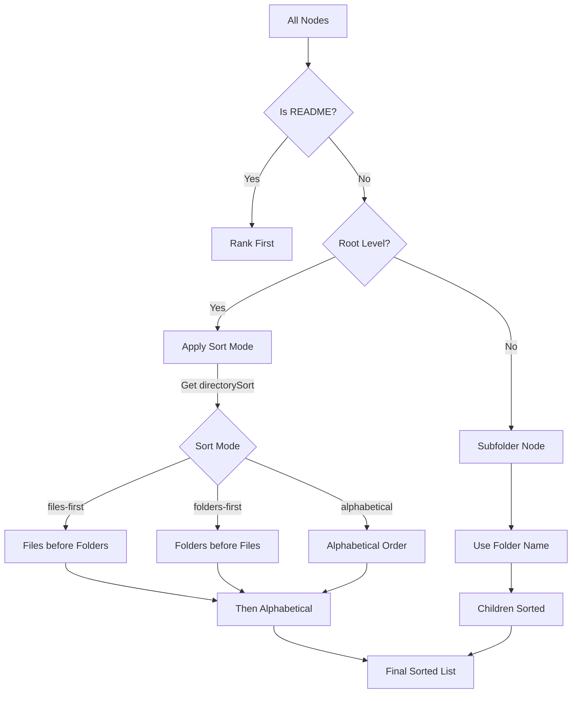

# TreeDataProvider

The TreeDataProvider module powers the Workspace Wiki sidebar tree, converting file system entries into readable, ordered nodes.

## Implementation

The TreeDataProvider is implemented in [`src/tree/treeProvider.ts`](../../src/tree/treeProvider.ts) as the `WorkspaceWikiTreeProvider` class, along with the `buildTree()` helper function in [`src/tree/buildTree.ts`](../../src/tree/buildTree.ts). The TreeNode interface is defined in [`src/types/treeNode.ts`](../../src/types/treeNode.ts).

## Responsibilities

- Implements VS Code's `TreeDataProvider` interface.
- Applies ordering rules:
    - A README at root always first, whatever its extension — `README.md`, `readme.txt`, or an extensionless `README`
    - Root-level docs next (alphabetical)
    - Folders (displayed by their own normalized name; an `index.md` appears as a child file, not as the folder node)
    - Files inside folders (alphabetical, with any README at top)
- Normalizes file names to human-friendly titles.
- Addresses nodes by URI, so the tree behaves the same on local, remote, and virtual file systems
- Supports sync functionality with active editor
- Provides efficient URI lookups via node mapping
- Handles tree view enhancements (collapse all, inline actions)

## Path and identity handling

Structure comes from `uri.path`, which is always forward-slash separated whatever the platform, so no separator normalization is needed. From it the builder derives the common base directory shared by every discovered file and slices each path against that base to place nodes.

Every node carries a `uri`, folders included. A folder's URI is derived from a child file's URI by truncating the path, which preserves the scheme and authority: on a virtual workspace a folder node addresses a real location rather than a fabricated `file:` path. That URI is what `resourceUri` is set to, so VS Code resolves folder icons against the actual file system provider.

`nodeMap` is keyed by `uri.toString()`. A URI string is exact and carries the scheme, so lookups need no path normalization or fallback scan, and two files with the same path under different schemes cannot collide. The `path` field on a node is a display value relative to the common base and is never used for identity.

## Key Methods

- `getTreeItem()` - Converts tree nodes to VS Code TreeItem objects
- `getChildren()` - Returns child nodes for tree expansion
- `getParent()` - Returns parent node for sync and reveal functionality
- `createTreeItem()` - Creates tree items with proper commands and icons
- `findNodeByUri()` - Node lookup by URI for the sync module
- `refresh()` - Triggers tree data change event; node map is cleared and rebuilt lazily on next `getChildren()` call

## Testing

**Unit Tests:**

- [`src/tree/buildTree.test.ts`](../../src/tree/buildTree.test.ts) - Tests for title normalization and tree building logic
- [`src/tree/treeProvider.test.ts`](../../src/tree/treeProvider.test.ts) - Tests for WorkspaceWikiTreeProvider class methods

**Test Coverage:**

- Tree building with various folder structures
- Title normalization including acronym handling
- File and folder sorting behaviors
- Node mapping and URI lookups
- Tree refresh and state management
- Edge cases and error handling

## Example

```ts
// Import the tree provider
import { WorkspaceWikiTreeProvider } from '@tree';

// Initialize the provider
const treeProvider = new WorkspaceWikiTreeProvider(
	vscode.workspace,
	vscode.TreeItem,
	vscode.TreeItemCollapsibleState,
	vscode.EventEmitter,
);
```

## Example Tree

```text
Workspace Wiki
├── README
├── Changelog
├── Docs
│   ├── README
│   └── API
```

See also: [Scanner/Indexer](./scanner.md)

## Ordering Logic


```mermaid
flowchart TD
	accTitle: Tree Node Ordering Logic
	accDescr: Shows how tree nodes are sorted - README nodes always rank first, then root-level nodes are ordered by the directorySort setting (files-first, folders-first, or alphabetical), and finally alphabetically by title within each group. Folder nodes always display their own normalized folder name; an index.md inside a folder is listed as a child file.
	A[All Nodes] --> B{Is README?}
	B -->|Yes| C[Rank First]
	B -->|No| D{Root Level?}
	D -->|Yes| E[Apply Sort Mode]
	D -->|No| F[Subfolder Node]
	E -->|Get directorySort| G{Sort Mode}
	G -->|files-first| H[Files before Folders]
	G -->|folders-first| I[Folders before Files]
	G -->|alphabetical| J[Alphabetical Order]
	H --> K[Then Alphabetical]
	I --> K
	J --> K
	K --> L[Final Sorted List]
	F --> N[Use Folder Name]
	N --> O[Children Sorted]
	O --> L
```

This diagram shows the node ordering logic: README files rank first, then root-level files/folders are sorted according to `directorySort` setting, then alphabetically by title within each type.
