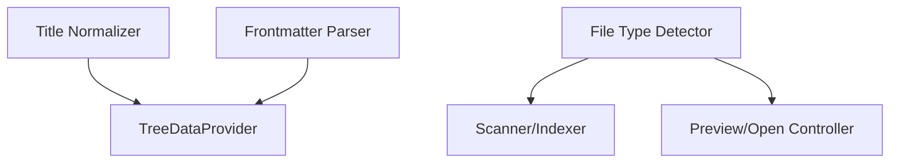

# Utilities

The Utilities module provides helper functions for title normalization, frontmatter parsing, and file type detection.

## Title Normalization

Converts file names like `userGuide.md` to `User Guide` for display in the tree.

### Title Normalization Example

```ts
function normalizeTitle(filename: string): string {
	// Converts 'userGuide.md' -> 'User Guide'
}
```

## Frontmatter Parsing

Optionally uses `gray-matter` to extract metadata from Markdown files.

### Frontmatter Parsing Example

```ts
import matter from 'gray-matter';

const { data, content } = matter(fileContent);
```

## File Type Detection

Determines how to handle files based on extension and mime type.

See also: [Settings Manager](./settings.md)

## Utilities Usage



This diagram shows how utility functions are used by other modules for title normalization, frontmatter parsing, and file type detection.
