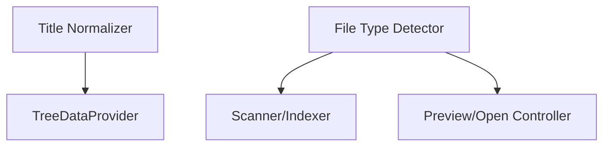

# Utilities

The Utilities module provides helper functions for title normalization and file type detection.

## Implementation

The utilities are implemented across multiple modules:

- [`src/utils/textUtils.ts`](../../src/utils/textUtils.ts) - Text processing functions like `normalizeTitle()`
- [`src/tree/buildTree.ts`](../../src/tree/buildTree.ts) - Tree building and processing functions like `buildTree()`, `sortNodes()`, `processNode()`

## Title Normalization

Converts file names like `userGuide.md` to `User Guide` for display in the tree.

### How Title Normalization Works

The `normalizeTitle()` function performs several transformations:

1. **Extension Removal**: Strips file extensions (`.md`, `.markdown`, `.txt`, etc.)
2. **Special README Handling**: Returns "README" for README files
3. **Case Conversion**: Transforms various naming conventions to Title Case:
    - `dash-case` → `Dash Case`
    - `snake_case` → `Snake Case`
    - `camelCase` → `Camel Case`
    - `PascalCase` → `Pascal Case`
4. **Acronym Preservation**: Maintains proper casing for technical terms

### Title Normalization Examples

```typescript
normalizeTitle('getting-started.md'); // → 'Getting Started'
normalizeTitle('api_reference.md'); // → 'API Reference'
normalizeTitle('userGuide.md'); // → 'User Guide'
normalizeTitle('HTMLParser.md'); // → 'HTML Parser'
normalizeTitle('README.md'); // → 'README'
```

### Acronym Casing

The function accepts an optional `acronyms` parameter to preserve proper casing:

```typescript
const acronyms = ['HTML', 'CSS', 'JS', 'API', 'URL', 'JSON', 'XML'];
normalizeTitle('htmlCssGuide.md', acronyms); // → 'HTML CSS Guide'
```

### Implementation Details

```typescript
function normalizeTitle(fileName: string, acronyms: string[] = []): string {
	// Remove file extension
	let title = fileName.replace(/\.[^/.]+$/, '');

	// Handle README files specially
	if (title.toLowerCase() === 'readme') {
		return 'README';
	}

	// Convert various cases to Title Case
	// Split on word boundaries, capitalize each word
	// Apply acronym casing if provided
}
```

## File Type Detection

Determines how to handle files based on extension and mime type.

See also: [Settings Manager](./settings.md)

## Utilities Usage



This diagram shows how utility functions are used by other modules for title normalization and file type detection.
