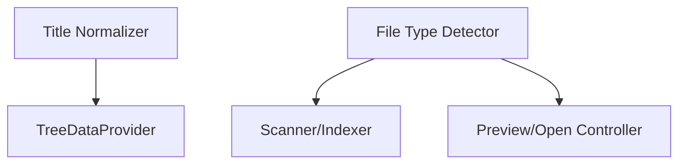

# Utilities

The Utilities module provides helper functions for title normalization, YAML front matter parsing, and file type detection.

## Implementation

The utilities are implemented across multiple modules:

- [`src/utils/textUtils.ts`](../../src/utils/textUtils.ts) - Text processing functions like `normalizeTitle()` and `extractFrontMatterTitle()`
- [`src/tree/buildTree.ts`](../../src/tree/buildTree.ts) - Tree building and processing functions like `buildTree()`, `sortNodes()`, `processNode()`

## YAML Front Matter Support

The extension parses YAML front matter from Markdown files to extract custom titles.

### How Front Matter Works

When a Markdown file contains YAML front matter with a `title` field, that title will be used in the tree view instead of the normalized filename.

#### Example

**File: `accessibility.md`**

```markdown
---
title: 'Introduction to Accessibility'
description: 'Guidance for creating more accessible code'
---

# Accessibility

This document provides guidance on creating accessible software.
```

**Tree View Display:** "Introduction to Accessibility" (instead of "Accessibility")

### Supported Front Matter Format

YAML front matter delimited by `---` is the only supported format. [`extractFrontMatter`](../../src/utils/textUtils.ts) splits the leading block with a regular expression that tolerates a UTF-8 byte order mark and CRLF line endings, then parses it with [js-yaml](https://github.com/nodeca/js-yaml).

js-yaml follows the YAML specification, which forbids tab characters in indentation. A front matter block indented with tabs does not parse, and the file falls back to its filename-derived title.

### Implementation Details

1. **Markdown Files Only**: Front matter parsing only applies to `.md` and `.markdown` files
2. **Title & Description Fields**: The `title` field is used for tree item display names, and the `description` field (when present) is extracted and shown as the tree item tooltip when hovering in the tree view
3. **Fallback**: If no front matter title exists, falls back to filename-based normalization
4. **File Access**: Files are read asynchronously through `vscode.workspace.fs` and decoded with `TextDecoder`, so parsing works against any file system provider, and are parsed during tree building
5. **Missing Files**: A `FileNotFound` or `ENOENT` error returns null values without logging, so a file deleted mid-scan does not produce noise

## Title Normalization

Converts file names like `userGuide.md` to `User Guide` for display in the tree.

### How Title Normalization Works

The `normalizeTitle()` function performs several transformations:

1. **Extension Removal**: Strips file extensions (`.md`, `.markdown`, `.txt`, etc.)
2. **Special README Handling**: Returns "README" for README files
3. **Case Conversion**: Transforms various naming conventions to Title Case:
    - `dash-case` → `Dash Case`
    - `snake_case` → `Snake Case`
    - `camelCase` → `Camel Case`
    - `PascalCase` → `Pascal Case`
4. **Acronym Preservation**: Maintains proper casing for technical terms

### Title Normalization Examples

```typescript
normalizeTitle('getting-started.md'); // → 'Getting Started'
normalizeTitle('api_reference.md', ['API']); // → 'API Reference'
normalizeTitle('userGuide.md'); // → 'User Guide'
normalizeTitle('htmlParser.md', ['HTML']); // → 'HTML Parser'
normalizeTitle('README.md'); // → 'README'
```

### Acronym Casing

The function accepts an optional `acronyms` parameter to preserve proper casing:

```typescript
const acronyms = ['HTML', 'CSS', 'JS', 'API', 'URL', 'JSON', 'XML'];
normalizeTitle('htmlCssGuide.md', acronyms); // → 'HTML CSS Guide'
```

## File Type Detection

[`getFileExtension`](../../src/utils/textUtils.ts) reads the extension from the final path segment only, so a dotted directory name such as `/docs.v2/README` does not yield a spurious extension. [`previewController.ts`](../../src/controllers/previewController.ts) passes it `uri.path` to choose the command for a file, and `extractFrontMatter` uses it to restrict parsing to Markdown.

See also: [Settings Manager](./settings.md)

## Utilities Usage


```mermaid
flowchart TD
  accTitle: Utilities Module Relationships
  accDescr: Shows how the utility functions are consumed by other modules. The title normalizer feeds the TreeDataProvider, while the file type detector feeds both the Scanner/Indexer and the Preview/Open Controller.
  A[Title Normalizer] --> B[TreeDataProvider]
  C[File Type Detector] --> D[Scanner/Indexer]
  C --> E[Preview/Open Controller]
```

This diagram shows how utility functions are used by other modules for title normalization and file type detection.
