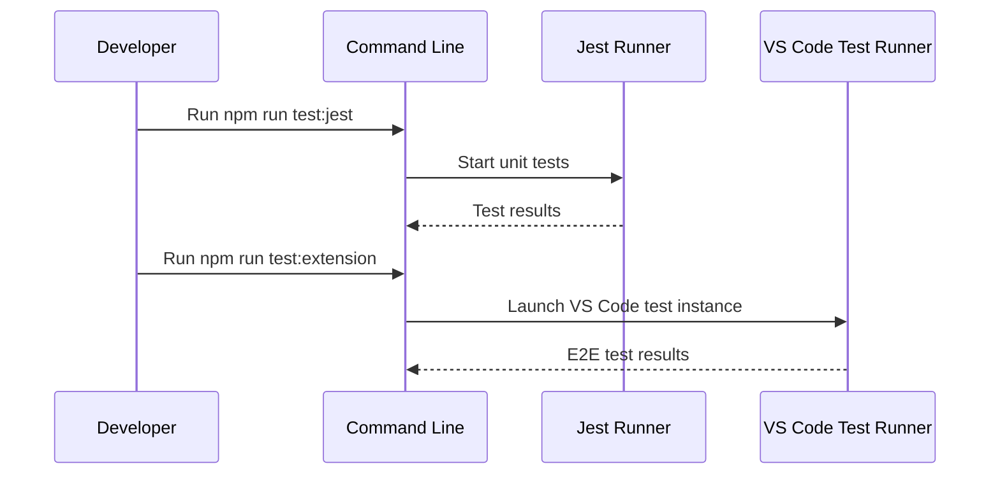

# Testing Guide

This guide explains how to run and write tests for the Workspace Wiki extension.

## Test Types

- **Unit Tests**: Test individual functions and modules (Jest).
- **E2E/Integration Tests**: Validate extension behavior in a running VS Code instance (`@vscode/test-electron`).

## Running Tests

- **Unit tests:**

    ```sh
    npm run test:jest
    ```

- **E2E tests:**

    ```sh
    npm run test:extension
    ```

- **Watch mode:**

    ```sh
    npm run watch-tests
    ```

- **All tests (validation):**

    ```sh
    npm run validate
    ```

## Test Locations

- Unit tests: `src/**/*.test.ts`
- E2E tests: `src/**/*.e2e.test.ts`
- Test utilities: `src/test/`

## Unit Test Coverage

**Tree Module Tests:**

- [`src/tree/buildTree.test.ts`](../../src/tree/buildTree.test.ts): Tests for file name normalization and tree building logic
- [`src/tree/treeProvider.test.ts`](../../src/tree/treeProvider.test.ts): Tests for WorkspaceWikiTreeProvider class methods

**Scanner Module Tests:**

- [`src/scanner/workspaceScanner.test.ts`](../../src/scanner/workspaceScanner.test.ts): Tests for workspace file scanning and filtering

**Extension Tests:**

- [`src/extension.test.ts`](../../src/extension.test.ts): Tests for main extension functionality and integration

**E2E Tests:**

- [`src/extension.e2e.test.ts`](../../src/extension.e2e.test.ts): End-to-end tests for extension behavior in VS Code

## Example Directory for Testing

The `example/` directory contains a variety of files and folders used to test and demonstrate the Workspace Wiki extension's features. Use these files to verify:

- File type support and filtering (see `file-types-test/`)
- Handling of ignored and hidden files (see `ignore-files-test/`)
- Tree structure, index/README handling, and nested folders

You can toggle extension settings (such as `showHiddenFiles`) and observe how the Workspace Wiki tree updates to reflect these changes using the files in `example/`.

## Example Unit Test

```ts
import { normalizeTitle } from '@tree';

test('normalizeTitle converts file names to titles', () => {
	expect(normalizeTitle('userGuide.md')).toBe('User Guide');
	expect(normalizeTitle('api-reference.md')).toBe('Api Reference');
});
```

## Example E2E Test

```ts
import * as vscode from 'vscode';

test('Workspace Wiki tree appears', async () => {
  const tree = vscode.window.createTreeView('workspaceWiki', { treeDataProvider: ... });
  expect(tree).toBeDefined();
});
```

## Test Workflow Diagram



This diagram shows the flow for running both unit and E2E tests.
