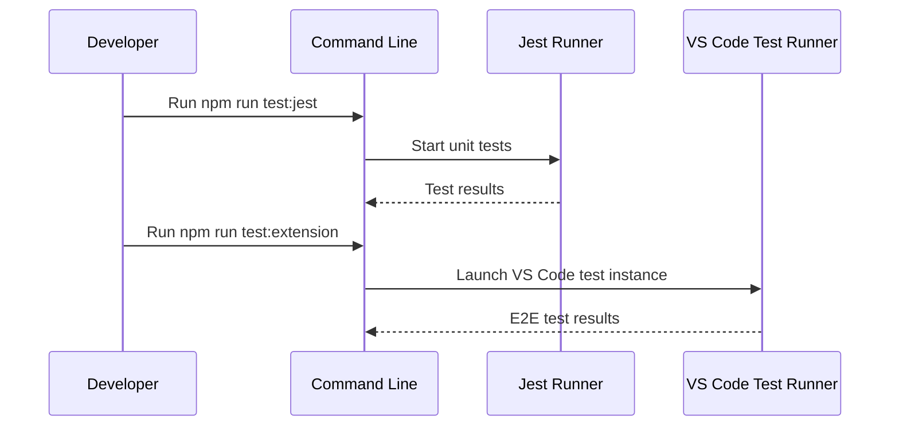

# Testing Guide

This guide explains how to run and write tests for the Workspace Wiki extension.

## Test Types

- **Unit Tests**: Test individual functions and modules (Jest).
- **E2E/Integration Tests**: Validate extension behavior in a running VS Code instance (`@vscode/test-electron`).

## Running Tests

- **Unit tests:**

    ```sh
    npm run test:jest
    ```

- **E2E tests:**

    ```sh
    npm run test:extension
    ```

- **Watch mode:**

    ```sh
    npm run watch-tests
    ```

## Test Locations

- Unit tests: `src/*.test.ts`
- E2E tests: `src/*.e2e.test.ts`
- Test utilities: `src/test/`

## Testing Hidden File Visibility

- The `workspaceWiki.showHiddenFiles` setting controls whether hidden files/folders (those starting with a dot, e.g. `.github`, `.env`) are shown in the Workspace Wiki tree.
- When `showHiddenFiles` is `false` (default), hidden files/folders are excluded from the tree (unless explicitly included by other settings).
- When `showHiddenFiles` is `true`, hidden files/folders are included in the tree unless excluded by `.gitignore` or `excludeGlobs`.
- Unit and E2E tests should verify that toggling this setting correctly includes/excludes hidden files and folders in the tree view.

## Example Unit Test

```ts
import { normalizeTitle } from './utils/title';

test('normalizeTitle converts file names to titles', () => {
	expect(normalizeTitle('userGuide.md')).toBe('User Guide');
});
```

## Example E2E Test

```ts
import * as vscode from 'vscode';

test('Workspace Wiki tree appears', async () => {
  const tree = vscode.window.createTreeView('workspaceWiki', { treeDataProvider: ... });
  expect(tree).toBeDefined();
});
```

## Test Workflow Diagram



This diagram shows the flow for running both unit and E2E tests.

## Screenshots

[INSERT SCREENSHOT HERE]
